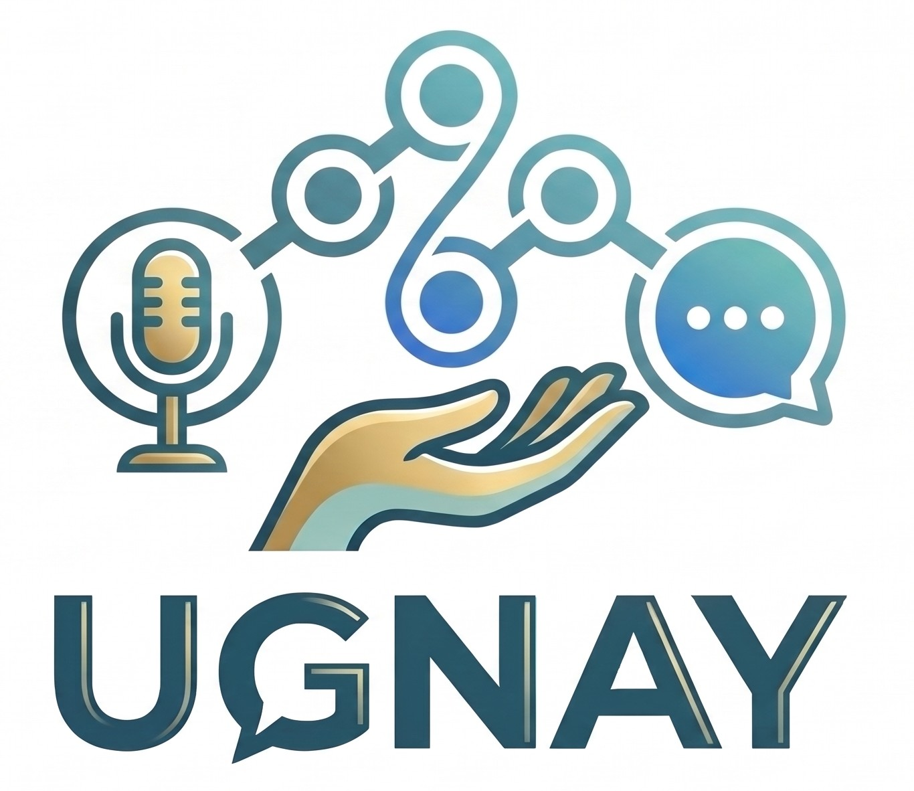

<div align="center">
  

  # UGNAY
  ### Voice-First Human Response Network
  **AI-Assisted Emergency Response, Intelligent Triage & Multi-Agency Dispatch Platform**

  <p align="center">
    
    
    
    
    
    
    
  </p>
</div>

---

## 📌 Overview

**UGNAY — Voice-First Human Response Network** is an AI-assisted emergency response platform that connects people who need help with appropriate human responders through voice. Instead of filling out forms or typing detailed reports, users simply speak to the Voice-First Assistant, which guides them through the emergency by asking relevant follow-up questions, identifying the incident category and urgency, and collecting important details such as location and the type of assistance needed.

Once the incident is understood, UGNAY places it in a responder queue and matches it with the nearest available responders based on emergency category, location, and availability. The system tracks responder status, including available, busy, offline, skipped, and no-response cases, until a suitable responder accepts the request.

Agora Real-Time Communication then connects the caller and responder through live voice and video communication. During the response, the AI assistant helps organize additional information and update the incident brief. After the incident, UGNAY generates response summaries and availability insights, helping coordinators understand response performance and identify gaps in emergency coverage.

---

## 🎯 Target Market

UGNAY primarily serves:
- **Local Communities & Citizens in Distress**
- **Emergency Response Organizations & Paramedics (EMS)**
- **Local Government Units (LGUs)**
- **Barangay First Responders & Tanods**
- **Disaster Risk Reduction and Management Offices (DRRMO)**
- **Fire & Law Enforcement Stations (BFP, PNP)**
- **Public & Private Healthcare Facilities**

It caters to any organization that needs faster, hands-free, and more accessible coordination between people requesting urgent emergency assistance and available field responders.

---

## ⚠️ The Pain Point (Evidence)

During emergencies, every second counts. However:
- **Barriers in Reporting:** People in distress struggle to fill out text forms, type on small touchscreens, or navigate complex apps due to panic, trauma, injury, or lack of technical literacy.
- **Fragmented Visibility:** Responders and dispatch centers often have limited visibility into which personnel or units are truly available and closest to the scene.
- **Triage Bottlenecks:** Manual intake causes critical delays in identifying emergency types, assessing life-threatening severity, matching appropriate units, and establishing direct voice contact.

UGNAY eliminates these gaps through guided voice interaction, intelligent responder queuing and routing, and instantaneous real-time communication.

---

## 💡 The How (Solution)

UGNAY uses a streamlined, voice-first operational workflow:
1. **Conversational Intake:** The AI-assisted voice assistant listens to natural speech in regional dialects (English, Tagalog/Filipino, Cebuano/Bisaya) and asks essential follow-up questions to clarify the emergency.
2. **Instant Classification & Triage:** Identifies the emergency category (Medical, Fire, Police, Flood/Rescue) and priority level, generating a structured real-time incident brief.
3. **Queueing & Proximity Routing:** Automatically queues the incident and ping-matches the nearest available response unit based on GPS coordinates and responder availability state (Available, Busy, Offline, Skipped, No Response).
4. **Hands-Free Calming & First-Aid Guidance:** While the caller is queued, the AI actively provides spoken calming reassurance and step-by-step first-aid protocols (e.g., wound pressure, burn care).
5. **Direct Match & Live Handover:** Once a responder accepts, Agora connects caller and responder directly in a live 1-to-1 audio/video channel.
6. **Post-Incident Intelligence:** UGNAY records the interaction, compiles complete triage summaries, and generates debrief reports for coordinators.

---

## ⚡ Strategic Integration

**Agora** is the core communication technology behind UGNAY's voice-first experience:
- **Agora Real-Time Communication (RTC):** Delivers ultra-low latency, reliable live voice and video streaming connecting the citizen and matched responder in real time.
- **Agora Real-Time Conversational AI & TTS:** Enables the Voice-First Assistant to engage in natural, empathetic dialogue during intake and queuing, guiding users seamlessly through high-stress situations.

This integration allows UGNAY to keep the entire experience voice-driven—from reporting an emergency and receiving guided first aid to connecting with a human responder—making emergency response drastically faster and universally accessible.

---

## 🌱 Sustainability & Growth

UGNAY is architected to scale from community-level response coordination to barangay, municipal, city, provincial, and regional emergency networks:
- **Expanding Emergency Categories:** Continuous additions of specialized emergency protocols (e.g., hazmat, mental health crisis, search and rescue).
- **Smarter Proximity Matching:** Integration with live traffic data, multi-tiered fleet routing, and automated mutual-aid re-routing.
- **Responder Analytics & Coverage Auditing:** Queue metrics, response times, and availability logs empower LGUs to detect responder shortages and optimize resource allocation over time.
- **Broader Localization:** Expanding native dialect speech synthesis and recognition across more Philippine and regional languages.
- **LGU & 911 Disaster System Interoperability:** Standardized webhooks and RESTful APIs connecting directly to government command centers.

---

## 🚑 Key Features

- 🎙️ **Voice-First AI Intake & Barge-In:** Natural speech conversation with instant voice interruption (barge-in) and calming de-escalation.
- 🇵🇭 **Multi-Dialect Support:** Full support for Cebuano / Bisaya, Tagalog / Filipino, and English.
- 📍 **Intelligent Proximity Matching:** Automated Haversine and routing calculation to dispatch nearest units.
- 📡 **Live Queuing & Active First-Aid:** Provides immediate life-saving first-aid instructions directly to the caller while matching occurs.
- 📹 **Agora Video & Audio Intercom:** One-touch high-definition live video connection with field paramedics or rescue officers.
- 🗺️ **Live GPS Map & Route Tracking:** Real-time route visualization between caller coordinates and responder station bays.
- 📊 **Realtime Sync & Incident Brief:** Backed by Supabase Realtime for instant multi-party dispatch updates and debrief generation.

---

## 📱 Tech Stack

- **Framework:** React Native / Expo (SDK 57)
- **Routing:** Expo Router (File-based navigation)
- **Live Communication (RTC & Voice AI):** Agora RTC Engine & Conversational Voice AI
- **Backend & Realtime Database:** Supabase (PostgreSQL + Realtime WebSockets)
- **AI & Speech Services:** OpenAI Whisper STT, TTS, and Emergency Triage Evaluation
- **Mapping & Routing:** OpenStreetMap, Leaflet, OpenRouteService API
- **Styling:** NativeWind (Tailwind CSS)
- **Icons:** Lucide React Native

---

## 🚀 Getting Started

### 1. Prerequisites
- Node.js (v18 or higher)
- npm or yarn
- Expo Go app or a modern web browser

### 2. Install Dependencies
```bash
npm install
```

### 3. Configure Environment Variables
Create a `.env` file in the root directory and populate your credentials:
```env
EXPO_PUBLIC_SUPABASE_URL=your_supabase_url
EXPO_PUBLIC_SUPABASE_ANON_KEY=your_supabase_anon_key
EXPO_PUBLIC_AGORA_APP_ID=your_agora_app_id
EXPO_PUBLIC_OPENAI_API_KEY=your_openai_api_key
```

### 4. Start Development Server
```bash
npx expo start
```

Press `w` in your terminal to open in a web browser, or scan the QR code with **Expo Go** on Android/iOS.

---

## 📄 License

This project is licensed under the MIT License - see the [LICENSE](LICENSE) file for details.
